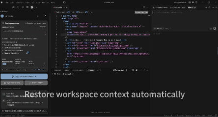

# Contorium

> Persistent workspace memory for AI coding.

AI coding assistants lose context constantly.

Contorium gives AI a continuous understanding of:
- your workspace
- active files
- Git changes
- coding goals
- recent activity

across:
- chats
- model switches
- IDE restarts
- long coding sessions

Built for Cursor, VS Code, Claude Code, and AI-native development workflows.



---

# Why?

AI tools forget everything.

Every new chat forces you to rebuild:
- project intent
- active files
- debugging progress
- architectural context

Contorium turns your workspace into a persistent memory layer for AI.

So your AI can continue where you left off.

---

# Core Features

## Persistent AI Workspace Memory
- active files
- current focus
- Git changes
- workspace summaries
- session memory

Stored locally in:

.contora/

---

## Resume AI Sessions

Close Cursor.

Come back tomorrow.

Your AI still understands:
- what changed
- what mattered
- what you're building

---

## Reduce Token Usage

Contorium reduces unnecessary context by:
- tracking only active workspace changes
- ranking important files
- compressing workspace history
- filtering noisy paths

Especially useful for:
- monorepos
- long AI sessions
- expensive frontier models

---

## Git-aware Context

Automatically tracks:
- modified files
- staged files
- recent commits
- working tree activity

---

## Local-first

- no cloud sync
- no hidden telemetry
- no session scraping
- BYOK optional

Your workspace memory stays local.

---

# Installation

## VSIX

Install from VSIX inside:
- VS Code
- Cursor

---

## From source

```bash
git clone https://github.com/ContoriumLabs/contorium
cd contorium
npm install
npm run compile